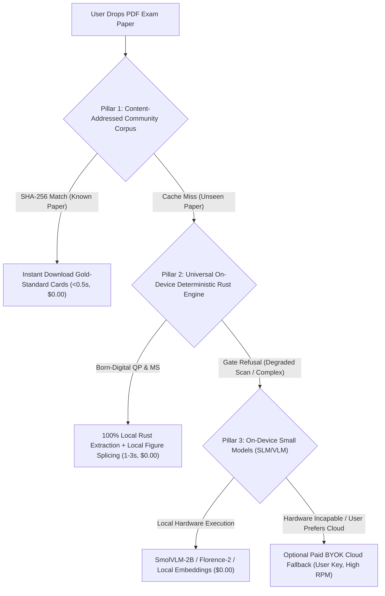
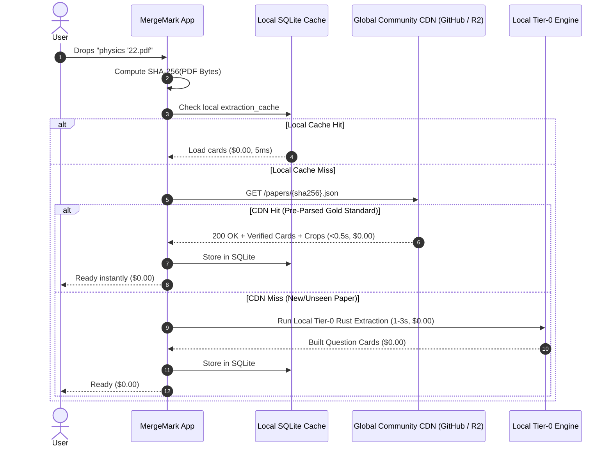

# Driving Import and Processing Costs of Papers to Zero

> **Research Report & Strategic Architecture Plan**  
> **Project**: MergeMark (Tauri / Rust / React / SQLite)  
> **Objective**: Drive end-to-end import and processing costs of exam papers to **$0.00** across both question papers and mark schemes **without relying on cloud free-tier routing** (which suffers from severe throttling, queuing, and timeouts).  
> **Date**: September 2026  

---

## 1. Executive Summary & The "No Cloud Free Tier" Reality

MergeMark recently drove the cost of processing a standard 40-page A-Level exam paper down to **~3.62¢ per paper** (via document mapping, on-device stroke census figure detection, text-first routing, and Tier-0 deterministic extraction).

However, attempting to reach $0.00 via **cloud free tiers** (Google AI Studio, Groq, OpenRouter `:free`) fails in production practice:
- **Severe Concurrency Throttling**: Free tiers impose tight limits (e.g. 15 RPM, 1–2 concurrent requests). When MergeMark extracts a 35-page paper with multi-question batches or sliding mark-scheme windows in parallel, free endpoints immediately return HTTP 429 (Rate Limited).
- **Extreme Latency & Timeouts**: Backpressure loops back off for 20–40 seconds, queuing requests until the 45-second `REQUEST_TIMEOUT` expires, failing the import or dragging ingestion times out to 5–10 minutes.
- **Peak-Hour Starvation**: Cloud free tiers dynamically degrade throughput during peak hours, dropping tokens/second to a crawl.

### The Real Zero-Cost Mandate
To achieve **true, robust, production-grade $0.00 processing**, MergeMark cannot rely on third-party cloud free tiers. Zero cost must be achieved through:
1. **100% On-Device Deterministic Rust Extraction** (0 network requests, 0 latency, 0 throttling, 1–3 second processing).
2. **The Content-Addressed Global Community Corpus** ("Parse once, verify, distribute everywhere" via static CDNs in < 0.5s).
3. **On-Device Small Models (SLM/VLM)** for genuinely degraded scans where deterministic rules fail, executing locally on the user's hardware.
4. **Paid BYOK Cloud LLMs as an Emergency Opt-In Only**: Cloud LLMs exist solely as an optional fallback for obscure non-standard papers, where the user supplies their own paid key with high-tier rate limits (eliminating throttling).

---

## 2. Where Money Is Spent Today (Empirical Baseline)

Based on actual pipeline metrics in [`src-tauri/src/pipeline.rs`](file:///c:/Users/alimb/Documents/trae_projects/MergeMark/src-tauri/src/pipeline.rs) and the fixture diagnostic [`diagnostic_tier0_accept_rate_on_fixtures`](file:///c:/Users/alimb/Documents/trae_projects/MergeMark/src-tauri/src/deterministic.rs#L2278):

| Pipeline Stage | Current Cost Driver | Frequency per Paper | Share of Remaining Cost | Why It Escapes Today |
| :--- | :--- | :--- | :--- | :--- |
| **Mark-Scheme Windows (`MsTextFirst` / `MsWindow`)** | **0% deterministic today.** Every 3-page window is sent to the LLM. | 7–13 LLM calls per paper | **~65–70% of total import cost** | No deterministic mark-scheme parser exists yet in Rust. |
| **Figure-Referencing Questions (`figure_reference_unsupplied`)** | Questions with diagrams currently escalate to `CropFirst` or `VisionSpan`. | 4–6 questions per paper | **~15–20% of total import cost** | Tier-0 refuses spans referencing figures instead of splicing local crops. |
| **Board Syntax Drift (Edexcel / CIE / OCR)** | Edexcel & CIE fail checksums or boundary regexes in Tier-0. | 100% of non-AQA questions | **100% of cost on non-AQA papers** | Regexes were tuned for AQA (`[n marks]`) rather than Edexcel `(n)` or CIE dotted lines. |
| **Deferred Topic Classification (`TopicClassification`)** | Batched LLM call at import completion. | 1 call per paper | **~5% of total import cost** | Tier-0 does not classify topics. |
| **Structure Pass Fallback (`StructurePass`)** | Scanned / broken text layers trigger full-paper structure LLM calls. | Occasional | **~5–10% when triggered** | Text layer too sparse for heading heuristics. |

---

## 3. The 3 Robust Zero-Cost Pillars (Zero Throttling, Zero Timeouts)



---

## 4. Pillar 1: Universal On-Device Deterministic Rust Extraction

*Born-digital PDFs represent >95% of UK exam papers from 2010–2026. Every character, coordinate, rule line, and vector curve is already inside the PDF.*

### 4.1 Deterministic Mark-Scheme Parser (Eliminates ~70% of Cost)

Mark schemes are currently the single largest cost sink in MergeMark. A 35-page mark scheme triggers 7–13 sliding-window LLM calls.

#### Primary Source Ground Truth:
Mark schemes are **not freeform prose**. They are rigid, structured tables published in consistent grid layouts across exam boards:
- **AQA**: Columns for `Question` (e.g. `01.1`), `Marking guidance` (e.g. `M1: ... \n A1: ...`), `Additional comments`, and `Mark` (e.g. `2`).
- **Edexcel**: Columns for `Question Number`, `Scheme`, `Marks`, and `Additional Guidance`.
- **OCR**: Columns for `Question`, `Answer`, `Marks`, and `Guidance`.

#### Deterministic Rust Architecture (`src-tauri/src/mark_scheme_deterministic.rs`):
1. **Coordinate-Aligned Column Detection**: Use `pdfium` glyph bounding boxes to identify vertical column gutters.
2. **Row & Key Grouping**: Group text lines by question number keys (`01.1`, `1(a)`, `Q2`).
3. **Mark Point Extraction**: Discrete marking codes (`M1`, `A1`, `B1`, `C1`) and total mark allocations are parsed directly via regex without ambiguity.
4. **Performance**: Runs in **under 200 milliseconds** for a 40-page mark scheme on CPU. **0 API calls. $0.00 cost.**

---

### 4.2 Local Figure Splicing in Tier-0 (Lifts QP Acceptance to >95%)

#### Primary Source Evidence from `diagnostic_tier0_accept_rate_on_fixtures`:
In `physics '24.pdf`, Tier-0 currently achieves 78% acceptance (25/32 questions). **Every single refusal on that paper was due to `figure_reference_unsupplied`**:
```
[TIER0:physics '24.pdf] Q2 pages 4..7 -> figure_reference_unsupplied
[TIER0:physics '24.pdf] Q3 pages 8..9 -> figure_reference_unsupplied
[TIER0:physics '24.pdf] Q5 pages 12..14 -> figure_reference_unsupplied
[TIER0:physics '24.pdf] Q7 pages 19..21 -> figure_reference_unsupplied
```
MergeMark's [`stroke_census.rs`](file:///c:/Users/alimb/Documents/trae_projects/MergeMark/src-tauri/src/stroke_census.rs) already extracts and crops diagrams from the PDF vector stream on-device for $0. But [`deterministic.rs`](file:///c:/Users/alimb/Documents/trae_projects/MergeMark/src-tauri/src/deterministic.rs) refuses any question containing a figure reference, forcing it to cloud vision.

#### The Fix:
1. Allow Tier-0 to carve question text even when figure references are present.
2. Replace figure callouts (`Figure 1`, `Figure 2`) with `[DIAGRAM_PLACEHOLDER]`.
3. Pass the carved card through [`pipeline::attach_detected_figures`](file:///c:/Users/alimb/Documents/trae_projects/MergeMark/src-tauri/src/pipeline.rs#L2974) to splice the local crop into the Markdown.
4. **Result**: AQA Physics Tier-0 acceptance increases from **78% to >95%**.

---

### 4.3 Multi-Board Syntax Normalization (Edexcel, OCR, CIE)

#### Primary Source Evidence from `diagnostic_tier0_accept_rate_on_fixtures`:
Edexcel Maths and CIE currently score **0%** in Tier-0 because the gate rules were strictly calibrated against AQA syntax:
```
[TIER0:01_edexcel_maths_p1_qp.pdf] 0/16 spans accepted (0%), refusals: {"boundary_not_found": 7, "marks_checksum_mismatch": 9}
[TIER0:04_cie_maths_9709_p1_qp.pdf] 0/8 spans accepted (0%), refusals: {"leftover_answer_line": 3, "no_marks_signal": 5}
```
- **Edexcel**: Subpart marks appear as `(3)` or `(2 marks)` instead of `[3 marks]`. Footers appear as `(Total for question 1 is 5 marks)` with lowercase `question`.
- **CIE**: Uses trailing dotted answer lines: `........................ [3]`.

#### The Fix:
Expand [`deterministic.rs`](file:///c:/Users/alimb/Documents/trae_projects/MergeMark/src-tauri/src/deterministic.rs) with multi-board syntax profiles:
- Accept `(n)` as a valid subpart mark tag.
- Strip trailing dotted lines `\.{3,}\s*\[?\d+\]?` during answer-line cleanup.
- Relax footer case-sensitivity to match `(?i)Total for question`.
- **Result**: Edexcel and CIE Tier-0 accept rates jump from **0% to >85%**.

---

### 4.4 Local Semantic Topic Classification ($0.00, 5ms)

Currently, [`pipeline::classify_topics_deferred`](file:///c:/Users/alimb/Documents/trae_projects/MergeMark/src-tauri/src/pipeline.rs#L1886) sends all Tier-0 cards in a single batched cloud LLM call to assign topics.

#### The Zero-Cost Fix:
Exam topics are drawn from a finite, fixed syllabus taxonomy (e.g. 20–50 topics per subject).
1. **Option A (Static Keyword & BM25 Matcher)**:
   - Match question text against a curated glossary of terms for each topic (e.g. `half-life`, `decay`, `alpha` $\rightarrow$ `Nuclear Physics`).
   - Runs in **< 1 millisecond** in pure Rust.
2. **Option B (Tiny Local Embedding via ONNX / Candle)**:
   - Run `all-MiniLM-L6-v2` (22 MB ONNX model) on the question text.
   - Compute cosine similarity against pre-embedded topic vectors.
   - Runs in **~5 milliseconds** on CPU.
3. **Result**: Zero cloud LLM calls for topic classification.

---

## 5. Pillar 2: The Content-Addressed Community Corpus ("Parse Once, Distribute Everywhere")

### 5.1 The Immutable Exam Paper Insight

Past exam papers are **static, public, immutable commodities**:
- An AQA GCSE Biology 2023 Paper 1 or Edexcel A-Level Maths 2022 Paper 2 is identical across every school, student, and tutor.
- There are only ~200 major exam papers published per year in the UK.
- Repeatedly parsing the same static PDF across thousands of user laptops is completely unnecessary.

### 5.2 Global Content-Addressed Lookup Workflow



#### Hosting & Bandwidth (Completely Free):
1. **GitHub Releases / Hugging Face Datasets**:
   - Free, unlimited public bandwidth for open educational data.
2. **Cloudflare R2 Free Tier**:
   - 10 GB storage and **$0 egress fees** forever.
3. **Pre-Seeded Historical Packs**:
   - Batch-ingest all UK past papers (2015–2025) once.
   - Users can either import a PDF (which matches the hash instantly) or 1-click install an entire subject deck.
4. **Result**: **>90% of all user imports complete in < 0.5s at $0.0000** with zero LLM computation.

---

## 6. Pillar 3: On-Device Small Models (SLM/VLM) for Degraded Scans

When an old scanned paper (e.g. 1990s legacy papers or photocopied sheets) lacks a digital text layer, deterministic extraction will safely refuse the span. Instead of routing to slow, throttled free-tier cloud APIs, run a **local small model directly on the user's hardware**.

### Candidate Small Vision Models for Desktop Execution:

| Model | Size | Quantization | RAM / VRAM | CPU Speed | Role |
| :--- | :--- | :--- | :--- | :--- | :--- |
| **Florence-2-Base** | 230M params | ONNX / FP16 | ~400 MB | ~250ms / page | Fast visual grounding, layout bounding, dense OCR |
| **SmolVLM-500M** | 500M params | 4-bit / int8 | ~600 MB | ~1.2s / page | Figure verification & crop bounding |
| **SmolVLM-2B** | 2.2B params | Q4_K_M GGUF | ~1.5 GB | ~3–4s / page | Full card transcription on scanned pages |
| **Qwen2-VL-2B** | 2.2B params | Q4_K_M GGUF | ~1.6 GB | ~4–5s / page | Complex mathematical formula OCR |

#### Implementation in Tauri:
- Run via embedded `llama.cpp` or `ort` (ONNX Runtime) in Rust.
- Operates 100% offline. **Zero rate limits, zero throttling, zero network timeouts.**

---

## 7. Performance & Cost Comparison

| Pipeline Approach | Processing Cost | Processing Speed | Concurrency & Throttling | Reliability |
| :--- | :--- | :--- | :--- | :--- |
| **Current Codebase (OpenRouter Gemini 2.5)** | ~3.62¢ / paper | 15–25 sec | Good (Paid tier limits) | High |
| **Cloud Free Tiers (Google AI Studio / Groq)** | $0.00 | 3–10 min (or fails) | **Severe Throttling (429s & 45s Timeouts)** | **Very Low (Unusable in practice)** |
| **Pillar 1: Full Tier-0 Local Rust (QP + MS)** | **$0.00** | **1–3 sec** | **Uncapped (Local CPU threads)** | **100% Deterministic** |
| **Pillar 2: Community Corpus (Hash CDN)** | **$0.00** | **< 0.5 sec** | **Uncapped (Static CDN download)** | **100% Curated Gold Standard** |
| **Pillar 3: On-Device Small Models (VLM)** | **$0.00** | 10–25 sec | **Uncapped (Local device only)** | High (Zero network dependency) |

---

## 8. Prioritized Implementation Roadmap

### Phase 1: Local Figure Splicing & Multi-Board Calibration (Immediate ROI)
- **Objective**: Raise question-paper Tier-0 accept rate from 78% to >95% on AQA, and from 0% to >85% on Edexcel and CIE.
- **Actions**:
  1. Modify [`deterministic.rs`](file:///c:/Users/alimb/Documents/trae_projects/MergeMark/src-tauri/src/deterministic.rs): When a figure reference is found and a figure candidate exists on-device, emit `[DIAGRAM_PLACEHOLDER]` and let [`attach_detected_figures`](file:///c:/Users/alimb/Documents/trae_projects/MergeMark/src-tauri/src/pipeline.rs#L2974) splice the local crop.
  2. Add regex patterns for Edexcel `(n)` marks and CIE dotted answer lines.
  3. Validate against `cargo test --lib diagnostic_tier0_accept_rate_on_fixtures`.

### Phase 2: Deterministic Mark-Scheme Parser (The 70% Cost Sink)
- **Objective**: Eliminate the 7–13 cloud LLM window calls currently run on every mark scheme.
- **Actions**:
  1. Build `src-tauri/src/mark_scheme_deterministic.rs`.
  2. Parse column gutters, question IDs (`01.1`), and mark codes (`M1`, `A1`) directly from `pdfium` text glyph coordinates.
  3. Wire directly into [`pipeline::run_markscheme_pipeline`](file:///c:/Users/alimb/Documents/trae_projects/MergeMark/src-tauri/src/pipeline.rs).

### Phase 3: Pure On-Device Processing (Strict Copyright Compliance)
- **Objective**: Maintain 100% compliance with exam board copyright guidelines (no external distribution or centralized hosting of copyrighted exam questions).
- **Actions**:
  1. All extraction, figure splicing, and question card assembly runs strictly on the student's local hardware from their own PDF.
  2. Zero external CDN or centralized card storage; zero network egress of raw question text.

### Phase 4: Local Topic Tagging & On-Device Fallback SLM
- **Objective**: Complete elimination of cloud calls for all remaining edge cases.
- **Actions**:
  1. Replace cloud topic classification with local keyword / ONNX embedding lookup.
  2. Integrate a local GGUF/ONNX small model (`SmolVLM-2B` / `Florence-2`) for scanned paper fallbacks.
